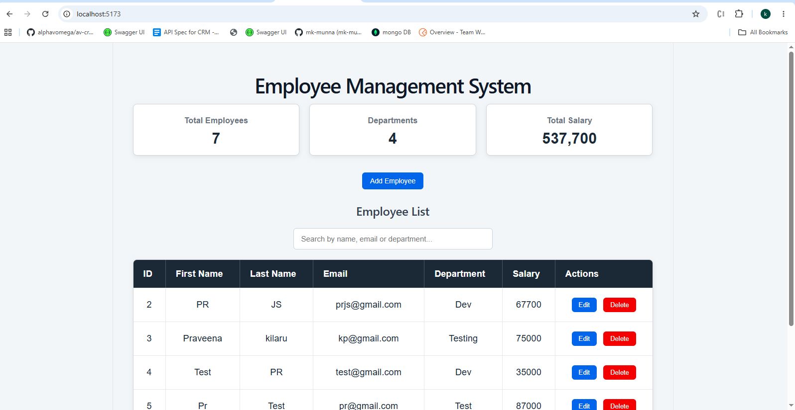
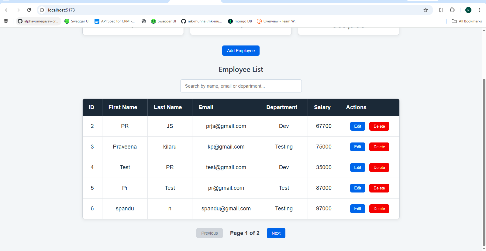
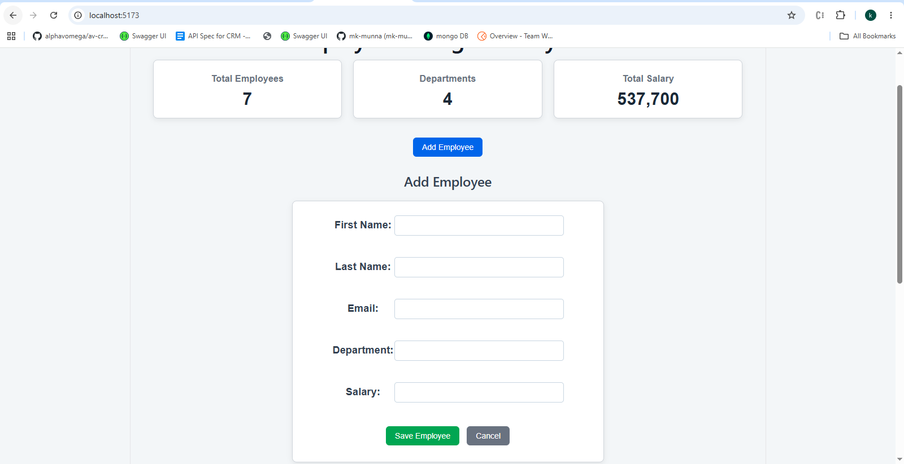
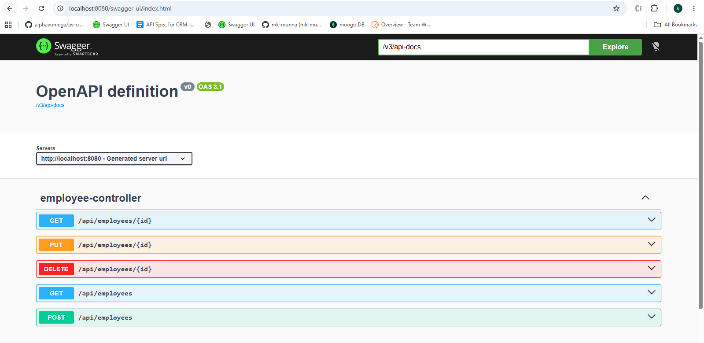

# Employee Management System

A full-stack Employee Management System built using React, Spring Boot, and PostgreSQL.

The application allows users to add, view, update, search, sort, and delete employee records through a React frontend connected to a Spring Boot REST API.

## Features

- Add employee
- View employees
- Update employee
- Delete employee
- Search employees
- Sort employee data
- Pagination
- Employee dashboard
- Form validation
- Error handling
- Swagger API documentation

## Technologies Used

### Frontend

- React
- Vite
- JavaScript
- Axios
- CSS

### Backend

- Java 17
- Spring Boot
- Spring Data JPA
- Jakarta Validation
- Maven

### Database

- PostgreSQL

### API Documentation

- Swagger / OpenAPI

## Application Flow

```text
React
  |
  | Axios
  ↓
Spring Boot REST API
  |
  | Spring Data JPA
  ↓
PostgreSQL
```

## REST API

| Method | Endpoint | Description |
|---|---|---|
| GET | `/api/employees` | Get all employees |
| GET | `/api/employees/{id}` | Get employee by ID |
| POST | `/api/employees` | Add employee |
| PUT | `/api/employees/{id}` | Update employee |
| DELETE | `/api/employees/{id}` | Delete employee |

## Employee Information

Each employee contains:

- ID
- First Name
- Last Name
- Email
- Department
- Salary

## Screenshots

### Dashboard



### Employee List



### Add/Edit Employee



### Swagger API



> Add these screenshot files to the `screenshots` folder before pushing the README.

## Project Structure

```text
employee-management-system
│
├── backend
│   └── employee-management
│       ├── src
│       ├── pom.xml
│       ├── mvnw
│       └── mvnw.cmd
│
├── frontend
│   └── employee-management-ui
│       ├── public
│       ├── src
│       ├── package.json
│       ├── package-lock.json
│       └── vite.config.js
│
├── screenshots
│   ├── dashboard.png
│   ├── employee-list.png
│   ├── employee-form.png
│   └── swagger.png
│
├── .gitignore
└── README.md
```

## How to Run

### Prerequisites

Make sure you have:

- Java 17
- Maven
- PostgreSQL
- Node.js
- npm

### Backend

Navigate to the backend:

```bash
cd backend/employee-management
```

Start Spring Boot:

```bash
mvnw.cmd spring-boot:run
```

Backend:

```text
http://localhost:8080
```

### Frontend

Open another terminal and navigate to:

```bash
cd frontend/employee-management-ui
```

Install dependencies:

```bash
npm install
```

Start the React application:

```bash
npm run dev
```

Frontend:

```text
http://localhost:5173
```

## Database Configuration

The application uses PostgreSQL to store employee information.

Configure the database connection in:

```text
backend/employee-management/src/main/resources/application.properties
```

Do not commit real database passwords or other sensitive credentials to GitHub.

## Swagger

Swagger/OpenAPI is used to document and test the backend REST API.

Start the Spring Boot application and open the Swagger UI configured for the project.

The available employee operations include:

- GET employees
- GET employee by ID
- POST employee
- PUT employee by ID
- DELETE employee by ID

## Author

**Praveena**

Full-Stack Developer